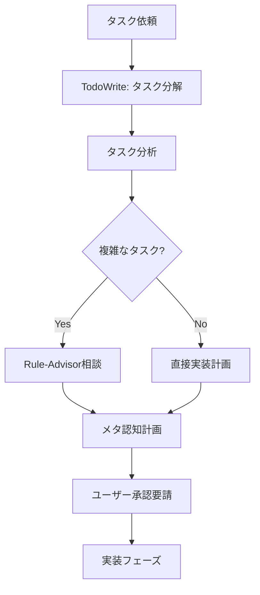
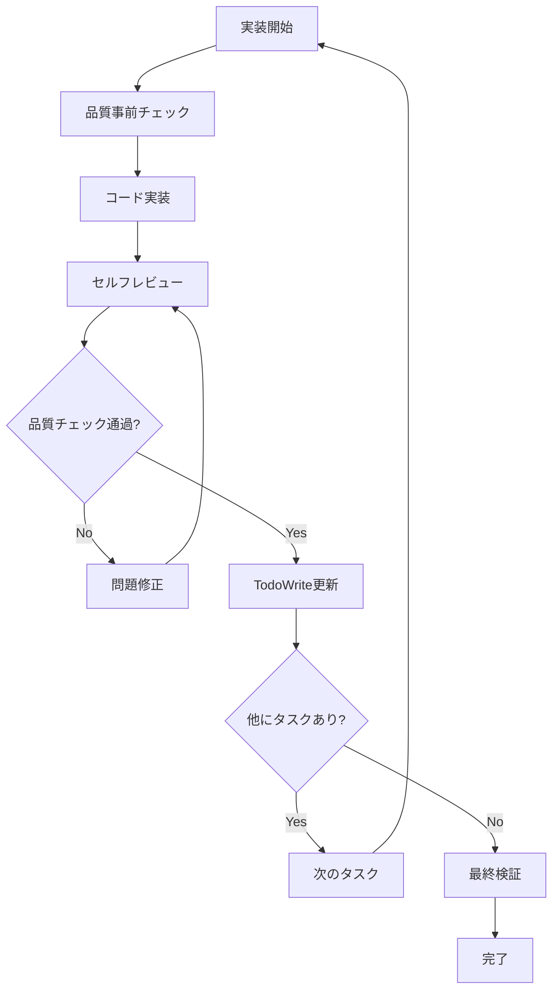
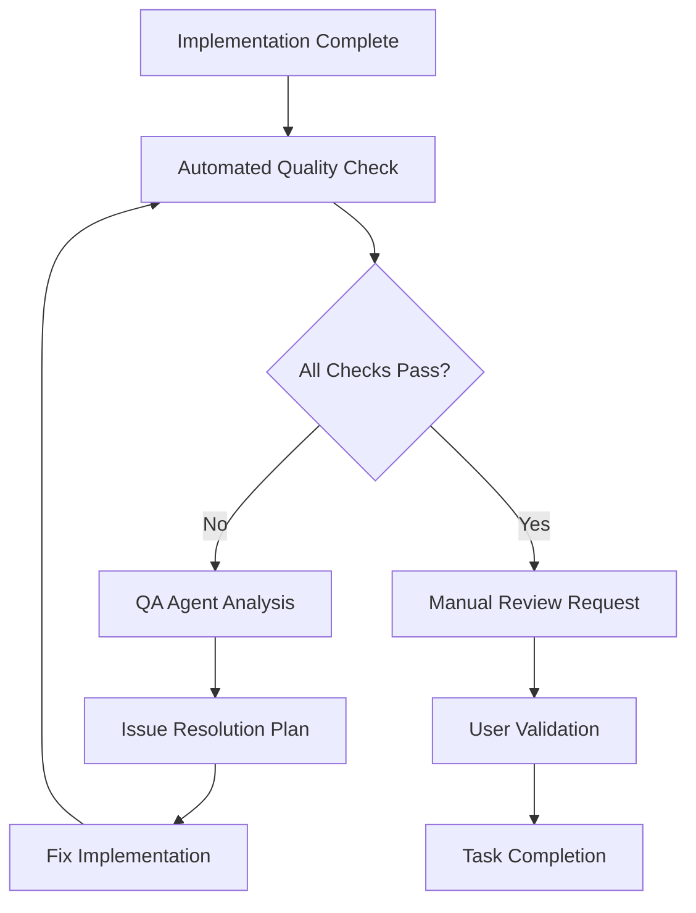
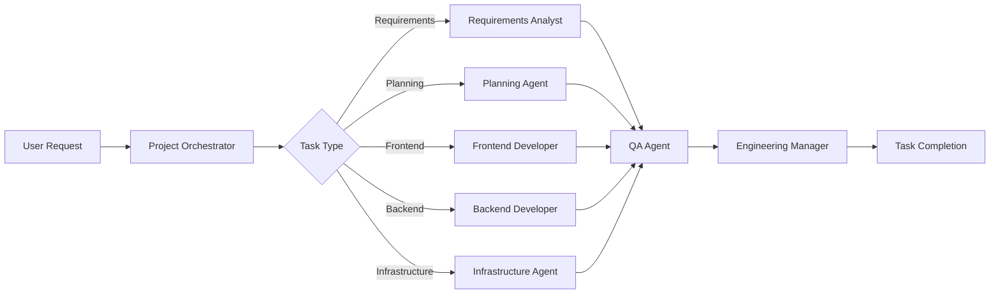
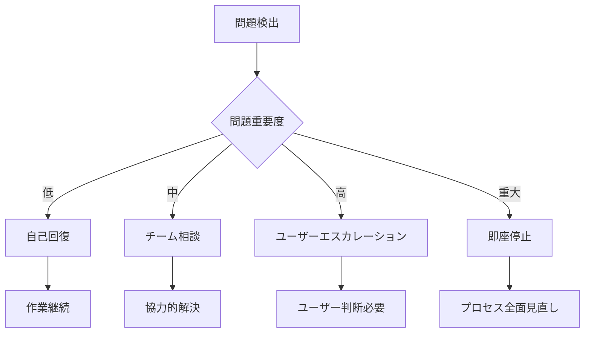

# Development Workflow

AI Agent Team開発フロー - マシンリーダブル且つヒューマンリーダブル

## Overview

このドキュメントは、AIエージェントチームによる開発プロセスの標準化フローを定義します。品質保証と効率性を両立させ、継続的改善を促進します。

## Core Principles

### 1. 品質優先（Quality First）
- **調査OK、実装STOP**: 全ての実装前にユーザー承認必須
- **品質ゲート**: エラー0でなければ完了不可
- **テストファースト**: 実装前のテスト設計

### 2. 構造化プロセス（Structured Process）
- **TodoWrite必須**: タスク分解と進捗追跡の徹底
- **段階的実装**: 大規模変更の分割実行
- **メタ認知実行**: タスクの本質理解優先

### 3. 継続的改善（Continuous Improvement）
- **失敗パターン学習**: 過去の失敗から改善
- **フィードバックループ**: 迅速な問題検出と修正
- **知識共有**: チーム全体の成長促進

## Development Flow

### Task Initiation Phase



#### 1. Task Decomposition (TodoWrite)
```yaml
mandatory_actions:
  - create_todo_list: true
  - decompose_complex_tasks: true
  - set_clear_acceptance_criteria: true

task_states:
  - pending: "未着手"
  - in_progress: "作業中（同時1タスク制限）"
  - completed: "検証完了済み"
```

#### 2. Rule-Advisor Consultation (Complex Tasks)
```yaml
trigger_conditions:
  - estimated_files: ">= 3"
  - complexity: "medium | high"
  - new_feature: true
  - architectural_change: true

consultation_output:
  - task_essence: "根本目的の理解"
  - applicable_rules: "関連ルールセクション"
  - first_action: "具体的な次のステップ"
  - warning_patterns: "避けるべき失敗パターン"
```

### Implementation Phase



#### Implementation Rules
```yaml
file_modification_limits:
  auto_stop_threshold: 5 # files
  confirmation_required: 3 # files
  single_task_focus: true

quality_gates:
  - type_check: "mandatory"
  - lint_check: "mandatory"
  - test_execution: "when_applicable"
  - error_count: 0

prohibited_patterns:
  - any_type_usage: "严格禁止"
  - todo_skip: "TodoWrite必須"
  - approval_skip: "ユーザー承認必須"
```

### Quality Assurance Phase



#### Quality Checklist
```yaml
automated_checks:
  - syntax_validation: true
  - type_checking: true
  - lint_compliance: true
  - test_coverage: "when_applicable"

manual_validation:
  - user_requirement_match: true
  - code_readability: true
  - architectural_consistency: true
  - performance_consideration: true
```

## Agent Collaboration Flow

### Standard Agent Interactions



### Agent Responsibilities Matrix

| Agent Type | Primary Responsibility | Quality Role | Output Artifacts |
|------------|----------------------|--------------|------------------|
| **Requirements Analyst** | 要求分析・要件定義 | 要件品質保証 | 要件定義書, ユーザーストーリー |
| **Planning Agent** | プロジェクト計画 | 計画品質保証 | 作業計画書, スケジュール |
| **Frontend Developer** | UI/UX実装 | フロントエンド品質保証 | コンポーネント, テストコード |
| **Backend Developer** | API・DB設計実装 | バックエンド品質保証 | API, データベース, テストコード |
| **QA Agent** | 品質保証 | 全体品質管理 | テスト計画, 品質レポート |
| **Engineering Manager** | チーム管理 | プロセス品質保証 | パフォーマンスレポート, 改善提案 |

## Error Handling & Recovery

### Auto-Stop Triggers

```yaml
critical_stops:
  - consecutive_errors: 3
  - large_scale_changes: 5 # files
  - same_error_pattern: 3 # times
  - unknown_type_overuse: true

recovery_actions:
  - root_cause_analysis: "5 Whys手法"
  - rule_advisor_consultation: "アプローチ再評価"
  - user_escalation: "アーキテクチャ変更時"
  - rollback_consideration: "安全な場合のロールバック検討"
```

### Escalation Matrix



## Process Optimization

### Feedback Loop Integration

```yaml
continuous_improvement:
  metrics_collection:
    - task_completion_time: true
    - error_frequency: true
    - user_satisfaction: true
    - code_quality_score: true
  
  review_cycles:
    - daily: "タスクレベルの振り返り"
    - weekly: "プロセス改善"
    - monthly: "ワークフロー最適化"
  
  improvement_actions:
    - rule_updates: "失敗パターンに基づく"
    - agent_training: "スキル向上"
    - process_refinement: "ワークフロー最適化"
```

## Configuration & Customization

### Project-Specific Adaptations

```yaml
customizable_elements:
  quality_gates:
    - threshold_adjustment: "プロジェクト複雑性に基づく"
    - additional_checks: "ドメイン固有要件"
  
  agent_configuration:
    - role_specialization: "プロジェクトニーズに基づく"
    - collaboration_patterns: "チームサイズに基づく"
  
  workflow_variations:
    - approval_levels: "ステークホルダー要件"
    - documentation_depth: "プロジェクト規模に基づく"
```

## Tools & Integrations

### Required Tools Matrix

| Phase | Tool Category | Specific Tools | Usage Pattern |
|-------|--------------|----------------|---------------|
| **計画** | タスク管理 | TodoWrite | 必須 |
| **分析** | ルール選択 | Rule-Advisor | 複雑なタスク |
| **実装** | コード品質 | Lint, TypeCheck | コミット前 |
| **テスト** | 品質保証 | Test Runners | 実装後 |
| **レビュー** | 協働 | PRツール | チーム検証 |

## Success Metrics

### Key Performance Indicators

```yaml
quality_metrics:
  - error_rate: "< 5% post-implementation"
  - test_coverage: "> 80% where applicable"
  - user_satisfaction: "> 90%"
  - first_time_right: "> 85%"

efficiency_metrics:
  - task_completion_velocity: "trending upward"
  - rework_percentage: "< 15%"
  - approval_cycle_time: "< 2 hours average"

team_metrics:
  - knowledge_sharing_frequency: "日次"
  - cross_training_completion: "四半期毎"
  - process_adherence: "> 95%"
```

---

## Implementation Notes

このワークフローは段階的に導入し、チームの成熟度に応じて最適化していきます。

### フェーズ1: 基盤構築 (現在)
- 基本的なTodoWrite活用
- 品質ゲートの確立
- ユーザー承認プロセスの徹底

### フェーズ2: 機能強化 (次段階)
- Rule-Advisor統合
- 自動品質チェック強化
- エージェント間連携最適化

### フェーズ3: 最適化 (将来)
- 予測的品質管理
- 自動化レベル向上
- 継続学習システム統合