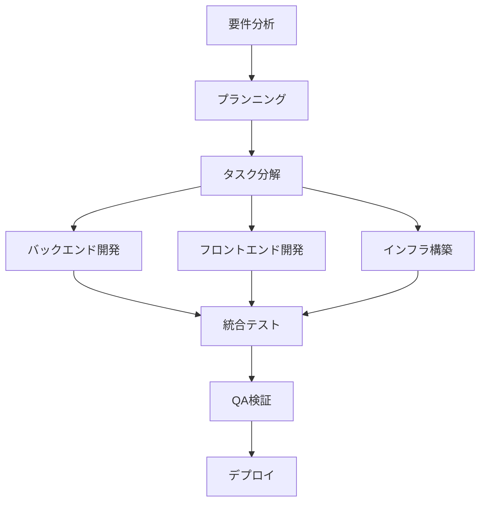

# AIエージェント開発ガイド - 技術的判断基準とアンチパターン集

## 1. AIエージェント間の協力方法

### 1.1 基本的な協力原則

#### 単一責任の原則
- 各エージェントは明確に定義された役割と責任範囲を持つ
- 他のエージェントの専門領域に越境しない
- 役割の重複や空白を避ける

#### コミュニケーション・チェーン
```
ユーザー → プロジェクト・オーケストレーター → 専門エージェント → プロジェクト・オーケストレーター → ユーザー
```

- 直接的なエージェント間通信は禁止
- すべての情報はプロジェクト・オーケストレーターを経由
- エージェント間の依存関係はオーケストレーターが管理

### 1.2 情報共有の標準化

#### 成果物の形式統一
```markdown
## エージェント名: [専門エージェント名]
## タスク: [実行したタスクの概要]
## 成果物: 
[具体的な成果物の内容]

## 次のステップへの引き継ぎ事項:
- 確認が必要な項目: [リスト]
- 他エージェントへの依頼事項: [リスト]
- ユーザー確認が必要な項目: [リスト]

## 品質チェック済み項目:
- [ ] 技術仕様への準拠確認
- [ ] セキュリティ要件の確認
- [ ] テストケースの妥当性確認
```

#### ファイル命名規則
```
docs/
├── requirements/     # 要求分析エージェント成果物
│   ├── user-story-[YYYYMMDD].md
│   └── requirements-[YYYYMMDD].md
├── planning/        # プランニング・エージェント成果物
│   ├── project-plan-[YYYYMMDD].md
│   └── technical-architecture-[YYYYMMDD].md
├── tasks/           # タスク分解エージェント成果物
│   ├── task-breakdown-[YYYYMMDD].md
│   └── dependency-graph-[YYYYMMDD].md
├── development/     # 開発エージェント成果物
│   ├── backend/
│   ├── frontend/
│   └── infrastructure/
└── qa/             # QAエージェント成果物
    ├── test-plan-[YYYYMMDD].md
    └── qa-report-[YYYYMMDD].md
```

### 1.3 依存関係の管理

#### タスクの優先順位付け
1. **ブロッカー**: 他のタスクを阻害する問題
2. **クリティカル**: プロジェクト成功に不可欠
3. **重要**: 品質向上に寄与
4. **通常**: 機能追加・改善
5. **低**: 将来的な検討事項

#### 並列作業の調整


## 2. 技術的判断の基準

### 2.1 技術選択の意思決定フレームワーク

#### 評価観点（重み付け例）
```
1. プロジェクト適合性 (30%)
   - 要件への適合度
   - 開発期間への影響
   - メンテナンス性

2. 技術的品質 (25%)
   - パフォーマンス
   - 拡張性
   - セキュリティ

3. チーム適合性 (20%)
   - 学習コスト
   - 既存知識との整合性
   - コミュニティサポート

4. 運用・保守性 (15%)
   - 監視・デバッグの容易さ
   - ドキュメント充実度
   - 長期サポート

5. コスト効率性 (10%)
   - ライセンス費用
   - インフラコスト
   - 開発効率
```

#### 技術選択記録テンプレート
```markdown
# 技術選択: [選択した技術名]

## 背景と要件
- 解決したい課題: [具体的な課題]
- 技術要件: [性能、機能要件]
- 制約条件: [予算、期間、スキル等]

## 検討候補
| 技術 | 適合性 | 品質 | チーム適合性 | 運用性 | コスト | 総合評価 |
|-----|-------|------|------------|-------|-------|----------|
| A   | 8     | 7    | 6          | 8     | 7     | 7.3      |
| B   | 9     | 8    | 8          | 7     | 6     | 7.8      |

## 決定理由
[選択した理由の詳細説明]

## 実装方針
- 導入手順: [ステップバイステップ]
- 移行戦略: [既存システムからの移行方法]
- リスク軽減策: [想定リスクと対策]
```

### 2.2 品質判断基準

#### コード品質チェックリスト
```markdown
## 機能性
- [ ] 仕様通りの動作を確認
- [ ] エッジケースの処理を確認
- [ ] エラーハンドリングの適切性

## 性能
- [ ] レスポンス時間が基準内
- [ ] メモリ使用量が適切
- [ ] データベースクエリが最適化済み

## セキュリティ
- [ ] 入力検証が実装済み
- [ ] 認証・認可が適切
- [ ] 機密情報の保護が実装済み

## 保守性
- [ ] コードが読みやすく構造化されている
- [ ] 適切なコメントが記述されている
- [ ] テストが網羅的に作成されている

## 拡張性
- [ ] 新機能追加が容易な設計
- [ ] 設定の外部化が実装済み
- [ ] インターフェースが明確に定義済み
```

## 3. 避けるべきアンチパターン

### 3.1 協力関係のアンチパターン

#### 🚫 エージェント越境（Role Boundary Violation）
**問題**: 他のエージェントの専門領域に干渉する
```markdown
❌ 悪い例:
バックエンド開発者エージェントがUI設計の提案をする

✅ 良い例:
バックエンド開発者エージェントはAPIの仕様のみを提供し、
UI設計はフロントエンド開発者エージェントに委ねる
```

#### 🚫 責任転嫁（Responsibility Shifting）
**問題**: 自分の責任範囲の作業を他のエージェントに押し付ける
```markdown
❌ 悪い例:
QAエージェントが「テストケースの作成はバックエンド開発者の責任」として作業を拒否

✅ 良い例:
QAエージェントが独立してテストケースを作成し、
実装者に確認・協力を依頼
```

#### 🚫 情報サイロ化（Information Silos）
**問題**: 重要な情報を他エージェントと共有しない
```markdown
❌ 悪い例:
インフラ担当者が重要な設定変更を独断で実行し、他エージェントに通知しない

✅ 良い例:
設定変更前にプロジェクト・オーケストレーターを通じて
関連エージェントに影響調査と承認を依頼
```

### 3.2 技術実装のアンチパターン

#### 🚫 過剰設計（Over-Engineering）
**問題**: 現在の要件に対して過度に複雑な設計を実装
```javascript
❌ 悪い例:
// 単純な名前→ビンゴカード変換に複雑なFactoryパターンを適用
class BingoCardAbstractFactory {
  createFactory(type) {
    switch(type) {
      case 'name': return new NameBingoCardFactory();
      case 'number': return new NumberBingoCardFactory();
      // 現在は name しか使わないのに複数のFactoryを実装
    }
  }
}

✅ 良い例:
// シンプルな関数で十分
function generateNameBingo(name) {
  const chars = name.split('');
  return createBingoGrid(chars);
}
```

#### 🚫 技術負債の先送り（Technical Debt Accumulation）
**問題**: 一時的な修正を永続化し、品質を劣化させる
```javascript
❌ 悪い例:
// TODO: あとで修正する
function generateBingo(name) {
  // ハードコードされた値（本当はconfigから読み込むべき）
  const size = 5;
  const freeSpace = true;
  
  // 不適切なエラーハンドリング
  if (!name) return null; // エラーなのかnullが正常値なのか不明
  
  // 複雑な処理がコメント無しで記述
  return name.split('').reduce((acc, char, i) => {
    acc[Math.floor(i / size)][i % size] = char;
    return acc;
  }, Array(size).fill().map(() => Array(size).fill('')));
}

✅ 良い例:
const CONFIG = {
  DEFAULT_BINGO_SIZE: 5,
  FREE_SPACE_ENABLED: true
};

function generateBingo(name) {
  if (!name || typeof name !== 'string') {
    throw new ValidationError('Valid name is required');
  }
  
  return createBingoGrid(name.split(''), CONFIG.DEFAULT_BINGO_SIZE);
}
```

#### 🚫 不適切な抽象化（Inappropriate Abstraction）
**問題**: 共通性のないものを無理やり抽象化する
```javascript
❌ 悪い例:
// ユーザー入力とAPIレスポンスを同じインターフェースで扱おうとする
class DataProcessor {
  process(data) {
    if (data.type === 'user_input') {
      return this.processUserInput(data);
    } else if (data.type === 'api_response') {
      return this.processApiResponse(data);
    }
    // 共通点がないのに同じクラスで処理しようとしている
  }
}

✅ 良い例:
// それぞれ独立した処理として実装
class UserInputProcessor {
  process(userInput) {
    return sanitizeAndValidate(userInput);
  }
}

class ApiResponseProcessor {
  process(apiResponse) {
    return parseAndTransform(apiResponse);
  }
}
```

### 3.3 プロセスのアンチパターン

#### 🚫 計画なき実装（Code First Development）
**問題**: 設計・計画なしに実装を開始する
```markdown
❌ 悪い例:
1. ユーザーが「ビンゴゲームを作って」と依頼
2. いきなりバックエンド開発者エージェントがコーディング開始
3. 途中でフロントエンドの要件が不明で作業が停止

✅ 良い例:
1. ユーザーが「ビンゴゲームを作って」と依頼
2. 要求分析エージェントが詳細な要件を確認
3. プランニング・エージェントが全体設計を作成
4. タスク分解エージェントが具体的なタスクに分解
5. 各開発エージェントが並行して作業開始
```

#### 🚫 手戻りの多発（Excessive Rework）
**問題**: 前工程の成果物の品質不良により、後工程で大幅な作り直しが発生
```markdown
❌ 悪い例:
- 要件定義が曖昧なまま実装開始
- QA段階で根本的な設計ミスが発覚
- 全面的な作り直しが必要になる

✅ 良い例:
- 各工程でチェックポイントを設定
- 次工程に進む前に品質確認を必須とする
- 早期に問題を発見・修正する
```

## 4. エラーハンドリング方針

### 4.1 エラー分類と対応方針

#### システムエラー（System Errors）
- **原因**: インフラ障害、外部サービス停止等
- **対応**: 自動リトライ、フェイルオーバー、アラート送信
- **担当**: インフラエージェント

#### ビジネスロジックエラー（Business Logic Errors）
- **原因**: 仕様違反、データ不整合等
- **対応**: エラーログ出力、安全な状態での停止
- **担当**: 該当する開発エージェント

#### バリデーションエラー（Validation Errors）
- **原因**: 不正な入力データ
- **対応**: ユーザーフレンドリーなエラーメッセージ表示
- **担当**: バックエンド・フロントエンド開発エージェント

### 4.2 エラー処理の実装パターン

#### 集約エラーハンドリング
```javascript
// エラー処理の中央集約
class ErrorHandler {
  static handle(error, context) {
    const errorInfo = {
      message: error.message,
      stack: error.stack,
      context: context,
      timestamp: new Date().toISOString(),
      agent: context.agent || 'unknown'
    };
    
    // ログ出力
    this.log(errorInfo);
    
    // ユーザー向けメッセージの生成
    return this.generateUserMessage(error);
  }
  
  static generateUserMessage(error) {
    if (error instanceof ValidationError) {
      return `入力内容に問題があります: ${error.message}`;
    }
    if (error instanceof SystemError) {
      return 'システムエラーが発生しました。しばらく時間をおいてお試しください。';
    }
    return '予期しないエラーが発生しました。';
  }
}
```

#### サーキットブレーカーパターン
```javascript
class CircuitBreaker {
  constructor(threshold = 5, timeout = 60000) {
    this.failureThreshold = threshold;
    this.resetTimeout = timeout;
    this.failureCount = 0;
    this.state = 'CLOSED'; // CLOSED, OPEN, HALF_OPEN
  }
  
  async execute(operation) {
    if (this.state === 'OPEN') {
      throw new Error('Circuit breaker is open');
    }
    
    try {
      const result = await operation();
      this.onSuccess();
      return result;
    } catch (error) {
      this.onFailure();
      throw error;
    }
  }
}
```

## 5. コミュニケーション規約

### 5.1 エージェント間の情報伝達形式

#### 標準メッセージフォーマット
```json
{
  "from": "backend-developer",
  "to": "project-orchestrator",
  "timestamp": "2024-01-15T10:30:00Z",
  "type": "task_completion",
  "payload": {
    "task_id": "TASK-001",
    "status": "completed",
    "deliverables": [
      {
        "type": "code",
        "path": "/src/services/bingo-service.js",
        "description": "ビンゴカード生成サービスの実装"
      }
    ],
    "next_actions": [
      {
        "agent": "qa-agent",
        "action": "test_execution",
        "priority": "high"
      }
    ]
  }
}
```

#### 進捗報告の標準化
```markdown
## 進捗報告: [エージェント名] - [日付]

### 完了した作業
- [x] タスクA: ビンゴカード生成APIの実装
- [x] タスクB: 入力バリデーション機能の追加

### 進行中の作業
- [ ] タスクC: エラーハンドリングの実装 (進捗: 60%)

### 次の作業予定
- [ ] タスクD: 単体テストの作成
- [ ] タスクE: API仕様書の更新

### 課題・懸念事項
- データベース接続が不安定（インフラエージェントに調査依頼済み）
- パフォーマンス要件の明確化が必要

### 他エージェントへの依頼事項
- @frontend-developer: API仕様の確認とフロントエンド実装の開始
- @qa-agent: テストケース作成の事前相談
```

### 5.2 コードレビューの実施方法

#### セルフレビューチェックリスト
```markdown
## 実装前チェック
- [ ] 実装する機能の仕様を正確に理解している
- [ ] 技術的な実装方針が決定されている
- [ ] 必要な外部依存性を特定している

## 実装後チェック
- [ ] 仕様通りの動作を確認
- [ ] エラーケースの処理を実装
- [ ] 適切なテストコードを作成
- [ ] コードコメントを記述
- [ ] 命名規則に準拠

## 品質チェック
- [ ] パフォーマンス要件を満たしている
- [ ] セキュリティ要件を満たしている
- [ ] 可読性・保守性を考慮した設計
```

#### クロスレビュー（他エージェントからのレビュー）要求基準
- **必須レビュー**: セキュリティ関連、外部API連携、データベース設計
- **推奨レビュー**: 複雑なビジネスロジック、新規技術の導入
- **任意レビュー**: 軽微な修正、コード整理

## 6. 継続的改善メカニズム

### 6.1 学習・適応プロセス

#### 失敗事例の蓄積と活用
```markdown
## 失敗事例記録: [事例番号]

### 概要
何が起こったか、いつ、どこで

### 根本原因
なぜ起こったのか（技術的・プロセス的原因）

### 影響
プロジェクトへの影響度、影響範囲

### 対策
- 即座の対応: [緊急対応内容]
- 恒久対策: [再発防止策]
- プロセス改善: [ルール・手順の見直し]

### 学習事項
- チームとして学んだこと
- 個別エージェントが学んだこと
- 改善したルール・手順

### 適用
- この学習を活かす場面
- 関連するアンチパターンの追加
- ガイドライン更新内容
```

#### 成功事例の標準化
```markdown
## 成功事例記録: [事例番号]

### 概要
どのような成果を達成したか

### 成功要因
なぜうまくいったのか

### 再現可能性
他の場面でも活用できるか

### 標準化内容
- 追加するベストプラクティス
- ガイドライン更新内容
- チェックリスト項目

### 横展開
- 他のプロジェクトへの適用方法
- エージェント定義への反映
```

### 6.2 ガイドライン進化プロセス

#### 四半期レビュー
1. **データ収集**: 過去3ヶ月の開発データ分析
2. **課題抽出**: 発生した問題、非効率な部分の特定
3. **改善案策定**: エンジニアリングマネージャーが改善案を作成
4. **チーム合意**: 全エージェントからのフィードバック収集
5. **ガイドライン更新**: 合意された改善の反映
6. **効果測定**: 次四半期での効果測定方法の設定

このガイドは、プロジェクト開始直後の実績がない状態から始まり、チームの成長と経験蓄積に応じて継続的に改善・発展させていく生きた文書である。