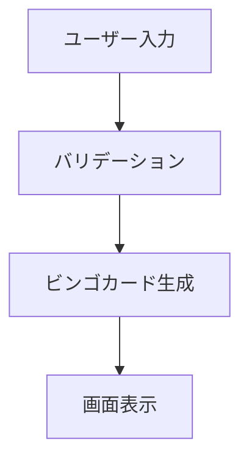

# ドキュメント作成基準

## 1. ドキュメント作成の品質基準

### 1.1 基本原則
- **正確性**: 情報は常に最新で正確であること
- **簡潔性**: 必要な情報を過不足なく伝えること
- **実用性**: 読者が実際に行動できる具体的な内容であること
- **維持可能性**: 継続的に更新・維持できる構造であること

### 1.2 文書構造の標準

#### 見出し階層
```markdown
# 文書タイトル (H1)
## 大項目 (H2)
### 中項目 (H3)
#### 小項目 (H4)
```

#### 標準テンプレート構成
1. **概要** - 文書の目的と対象読者
2. **前提条件** - 必要な知識や環境
3. **手順/内容** - メインコンテンツ
4. **例** - 具体的な実装例
5. **補足** - 注意事項や参考情報
6. **更新履歴** - 変更履歴と理由

### 1.3 コード記述の標準

#### コードブロック
```javascript
// 良い例：言語指定とコメント付き
function generateBingo(name) {
  // 名前を文字に分解
  const chars = name.split('');
  return createGrid(chars);
}
```

#### インラインコード
- ファイル名、コマンド、変数名は `code` 形式で記述
- 例：`package.json` ファイルを編集し、`npm install` コマンドを実行

### 1.4 図表・画像の基準
- 図表にはキャプションと番号を必須とする
- 画像は最大幅800px以内
- フローチャートにはMermaid記法を推奨



## 2. 必須ドキュメントの種類

### 2.1 プロジェクトレベル

#### README.md（必須）
- プロジェクト概要
- セットアップ手順
- 使用方法
- 貢献方法
- ライセンス情報

```markdown
# プロジェクト名

## 概要
プロジェクトの簡潔な説明

## セットアップ
### 前提条件
- Node.js 22以上
- npm 最新版

### インストール手順
1. リポジトリのクローン
   ```bash
   git clone <repository-url>
   ```
2. 依存関係のインストール
   ```bash
   npm install
   ```
```

#### CONTRIBUTING.md（推奨）
- 開発参加のガイドライン
- コード貢献の手順
- Issue報告の方法

### 2.2 機能仕様レベル

#### 機能仕様書（feature-spec-*.md）
```markdown
# 機能名: ビンゴカード生成

## 概要
ユーザー名からビンゴカードを生成する機能

## 機能要件
### FR-001: 名前入力機能
- ユーザーは1-20文字の名前を入力できる
- 特殊文字は使用不可

### FR-002: カード生成機能
- 5x5のビンゴカードを生成
- 中央はFREE枠とする

## 非機能要件
### NFR-001: パフォーマンス
- カード生成は1秒以内に完了

## 受け入れ条件
- [ ] 有効な名前でカードが生成できる
- [ ] 不正な名前でエラーメッセージが表示される
```

#### API仕様書（api-spec.md）
- OpenAPI/Swagger形式を推奨
- エンドポイント一覧
- リクエスト/レスポンス例
- エラーコード一覧

### 2.3 技術設計レベル

#### アーキテクチャ設計書（architecture.md）
- システム全体構成
- 技術スタック選定理由
- データフロー図
- セキュリティ考慮事項

#### データベース設計書（database-design.md）
- ER図
- テーブル定義
- インデックス設計
- データ移行戦略

### 2.4 運用・保守レベル

#### デプロイメント手順書（deployment.md）
- 環境別デプロイ手順
- 設定ファイルの管理方法
- ロールバック手順
- 監視・ログ確認方法

#### トラブルシューティングガイド（troubleshooting.md）
- よくある問題と解決方法
- ログの読み方
- 緊急時の連絡先

## 3. 更新頻度とメンテナンス方針

### 3.1 ドキュメントカテゴリ別更新頻度

| カテゴリ | 更新頻度 | 担当 |
|---------|---------|------|
| README.md | プロジェクト変更時 | 全開発者 |
| API仕様書 | API変更時 | バックエンド開発者 |
|機能仕様書 | 機能追加/変更時 | 要求分析エージェント |
| 技術仕様 | アーキテクチャ変更時 | エンジニアリングマネージャー |
| 運用手順 | 月次レビュー | インフラ担当者 |

### 3.2 ドキュメント品質の監視
- PRレビュー時にドキュメント更新の確認を必須とする
- 四半期ごとにドキュメント棚卸しを実施
- ユーザーフィードバックを基にした改善実施

### 3.3 ドキュメント廃止基準
- 機能削除から6ヶ月経過したドキュメント
- 年次レビューで利用実績のないドキュメント
- 廃止時は理由と代替手段を明記

## 4. レビュープロセス

### 4.1 ドキュメントレビューの種類

#### セルフレビュー（作成者）
作成後、以下をチェック：
- [ ] 誤字脱字の確認
- [ ] リンクの動作確認
- [ ] コードサンプルの動作確認
- [ ] 対象読者に適した内容か

#### ピアレビュー（同僚）
- 技術的正確性の確認
- 理解しやすさの評価
- 不足情報の指摘

#### 専門家レビュー（分野の専門家）
- 設計レベルの妥当性
- セキュリティ観点のチェック
- 業界標準との整合性

### 4.2 レビュー実施基準

#### 必須レビュー対象
- 新規ドキュメント作成
- 大幅な内容変更（50%以上の変更）
- セキュリティ関連情報の追加/変更

#### 簡易レビュー対象
- 軽微な修正（誤字脱字、リンク修正）
- 情報の追記（例の追加など）

### 4.3 レビューツールとワークフロー

#### GitHub Pull Request
```markdown
## ドキュメントレビューチェックリスト

### 内容確認
- [ ] 情報の正確性
- [ ] 手順の実行可能性
- [ ] コードサンプルの動作確認

### 品質確認
- [ ] 日本語の自然さ
- [ ] 構造の分かりやすさ
- [ ] 必要な情報の網羅性

### 形式確認
- [ ] Markdownの正しい記法
- [ ] 画像の表示確認
- [ ] リンクの動作確認
```

## 5. 特別な文書種別

### 5.1 意思決定記録（ADR: Architecture Decision Records）
重要な技術的意思決定は以下の形式で記録：

```markdown
# ADR-001: データベースエンジンの選択

## ステータス
承認済み

## 決定内容
PostgreSQLを採用する

## 背景
- 複雑なクエリが必要
- JSONデータの扱いが必要
- スケーラビリティが重要

## 検討した選択肢
1. MySQL - 実績豊富だが、JSON処理に制限
2. PostgreSQL - 高機能、JSON対応良好
3. MongoDB - NoSQLだが、一貫性に課題

## 決定理由
PostgreSQLのJSON型サポートと、ACIDプロパティの両方が必要

## 結果
- 開発効率の向上
- データ整合性の保証
- 将来的な拡張性の確保
```

### 5.2 緊急事態対応書（Runbook）
障害対応時に必要な情報を即座に確認できる形式：

```markdown
# 障害対応: サーバーレスポンス遅延

## 概要
APIレスポンス時間が1秒を超える場合の対応手順

## 緊急度: 高

## 影響範囲
全ユーザーのビンゴカード生成機能

## 一次対応（5分以内）
1. APMダッシュボードでボトルネック確認
2. CPU/メモリ使用率チェック
3. 必要に応じてスケールアウト実行

## 二次対応（30分以内）
1. データベースクエリの最適化
2. キャッシュ戦略の見直し
3. ログ分析による根本原因調査
```

## 6. 多言語対応

### 6.1 国際化対応
- 主要ドキュメントは日本語と英語で作成
- 技術仕様書は英語を推奨
- ユーザー向けドキュメントは多言語対応検討

### 6.2 翻訳品質管理
- 機械翻訳後の人手による校正必須
- 技術用語の統一（用語集の管理）
- ネイティブスピーカーによる最終確認

## 7. ドキュメント測定とKPI

### 7.1 品質指標
- **完全性**: 必要なドキュメントの存在率 95%以上
- **最新性**: 関連コード変更後の更新率 100%
- **活用性**: 月間アクセス数（内部/外部）
- **満足度**: 開発者アンケート結果 4.0/5.0以上

### 7.2 改善サイクル
1. 月次: ドキュメント利用統計の確認
2. 四半期: 品質評価とフィードバック収集
3. 半年: ドキュメント戦略の見直し
4. 年次: 大規模な構造変更の検討

この基準は、チーム の成長と共に継続的に改善し、常に実用的で価値のあるドキュメント文化を維持する。