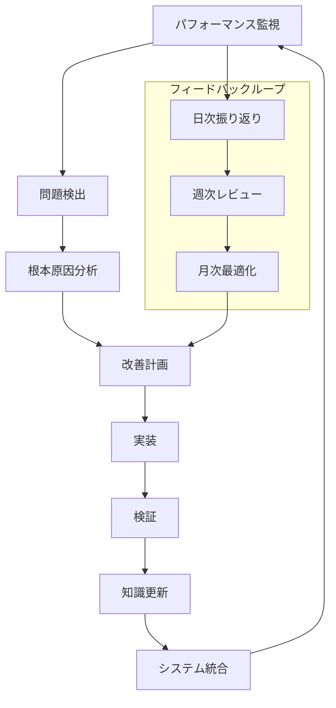
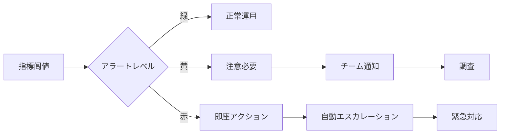
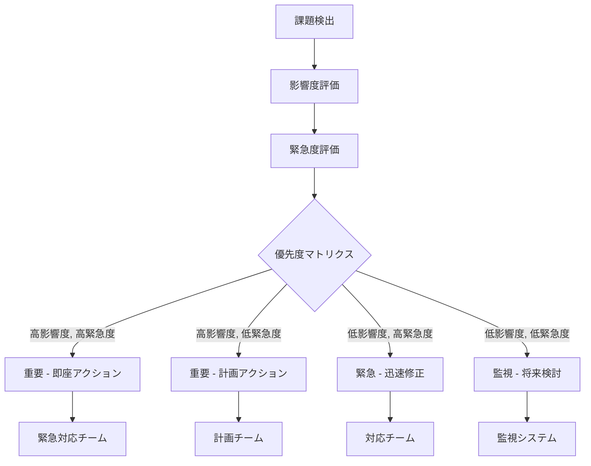
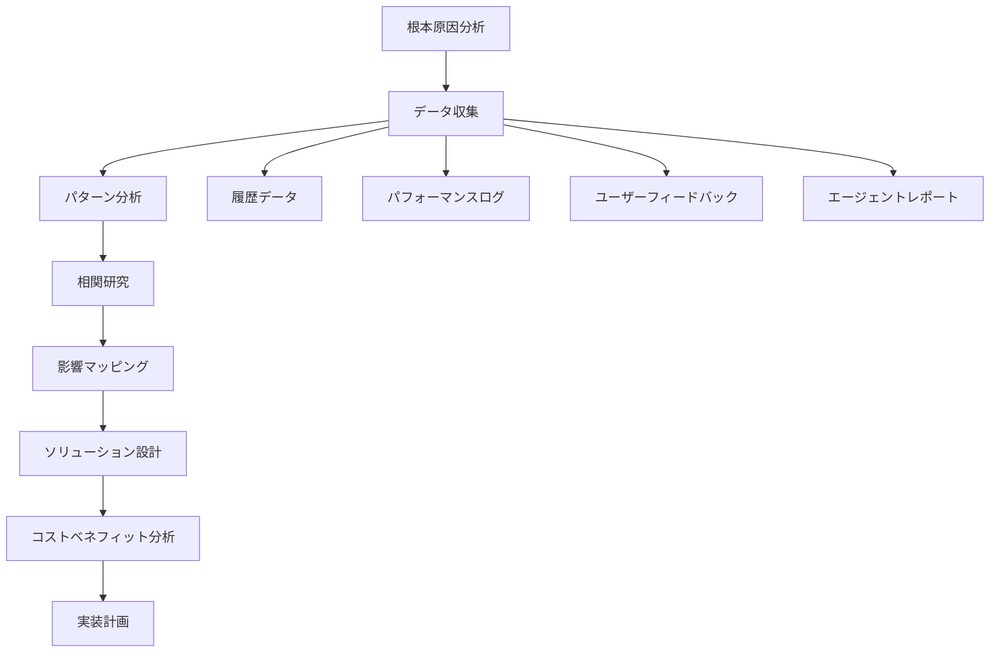
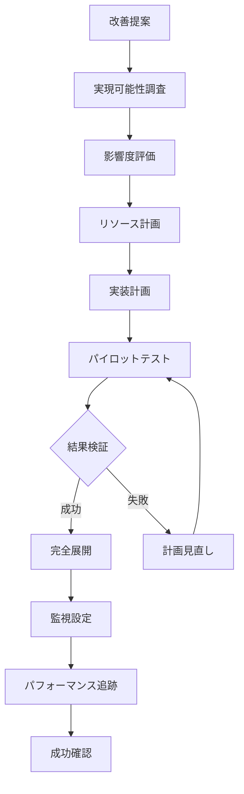
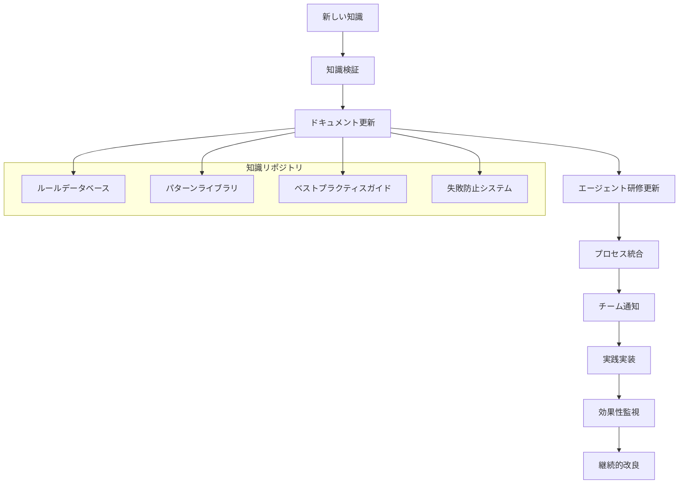
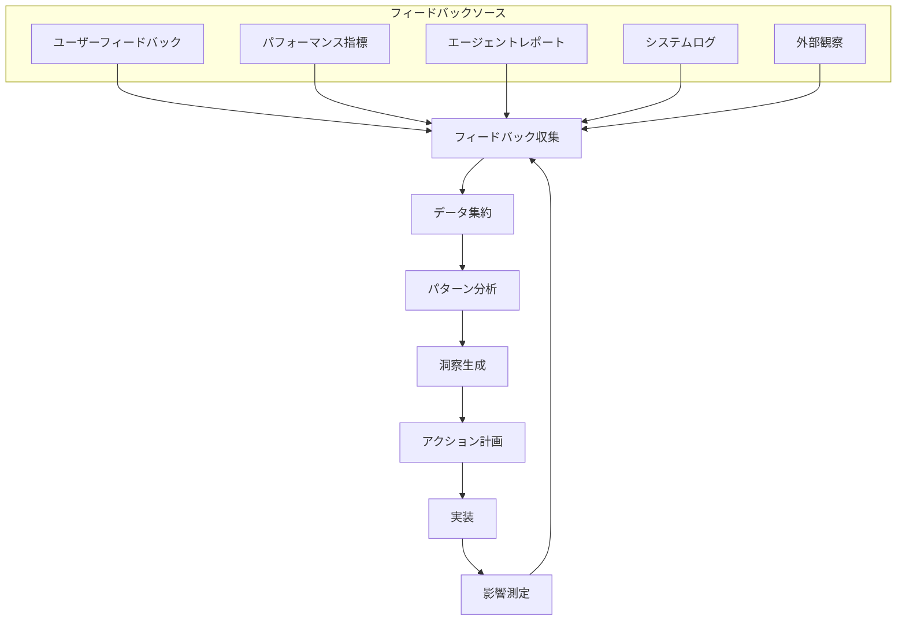
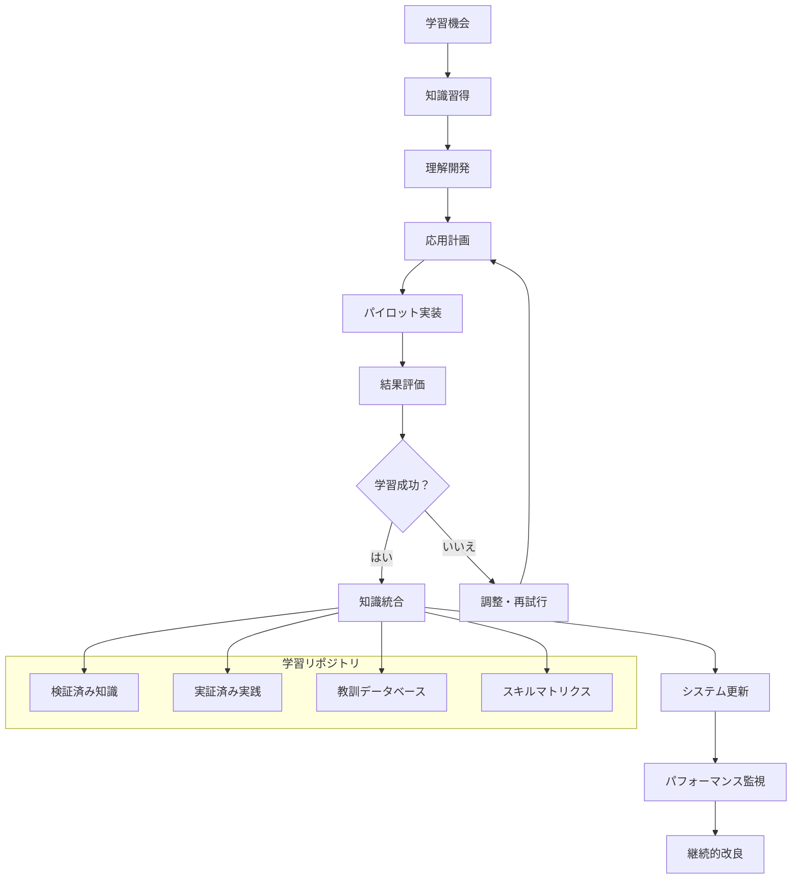
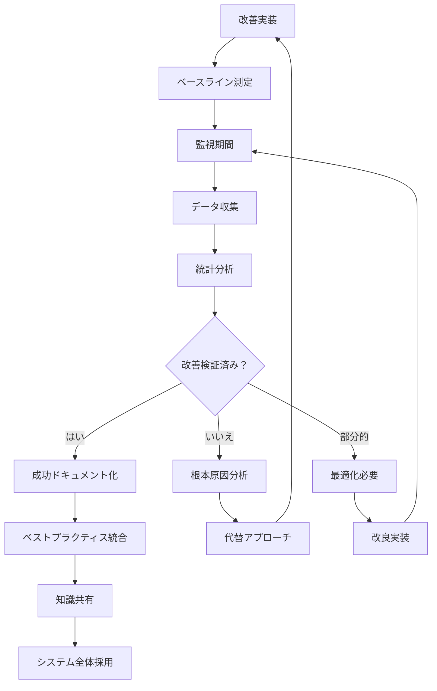

# チーム改善フロー

AIエージェントチーム継続改善フロー - 自己進化システム

## 概要

このドキュメントは、AIエージェントチームが自己改善し続けるための構造化されたプロセスを定義します。データドリブンな改善と組織学習を通じて、チーム全体のパフォーマンスを継続的に向上させます。

## 基本哲学

### 1. データドリブン改善（Data-Driven Improvement）
- **測定可能な指標**: 定量的な改善目標設定
- **証拠ベース**: 実際のデータに基づく意思決定
- **継続的モニタリング**: リアルタイム改善機会検出

### 2. 学習組織（Learning Organization）
- **失敗からの学習**: エラーパターンの体系化
- **知識の共有**: チーム全体での経験蓄積
- **適応的進化**: 環境変化への柔軟な対応

### 3. 体系的アプローチ（Systematic Approach）
- **構造化プロセス**: 予測可能で再現性のある改善
- **フィードバックループ**: 迅速な問題検出と修正
- **メタ認知**: 改善プロセス自体の改善

## 改善フロー概要



## パフォーマンス監視システム

### リアルタイム指標収集

```yaml
performance_indicators:
  task_execution:
    completion_rate: "タスク成功完了率"
    average_time: "開始から完了までの時間"
    error_frequency: "タスクあたりのエラー数"
    rework_rate: "再作業が必要な率"
  
  quality_metrics:
    first_time_right: "再作業なしで完了したタスク率"
    user_satisfaction: "承認率とフィードバックスコア"
    code_quality: "自動品質スコア"
    test_coverage: "テストでカバーされたコードの率"
  
  collaboration_efficiency:
    handoff_time: "エージェント間引き継ぎ時間"
    communication_clarity: "誤解頻度"
    knowledge_sharing: "情報伝達効果"
    decision_speed: "意思決定までの時間"

monitoring_frequency:
  real_time: ["error_detection", "performance_alerts"]
  daily: ["task_completion", "quality_scores"]
  weekly: ["trend_analysis", "pattern_detection"]
  monthly: ["comprehensive_review", "strategic_planning"]
```

### アラートシステム



## 課題検出と分類

### 自動課題検出

```yaml
detection_categories:
  performance_degradation:
    triggers:
      - completion_time_increase: "> 20%"
      - error_rate_spike: "> 10%"
      - user_satisfaction_drop: "> 15%"
    
  quality_issues:
    triggers:
      - test_failure_increase: "> 5%"
      - code_review_rejections: "> 25%"
      - rework_rate_spike: "> 20%"
    
  collaboration_problems:
    triggers:
      - handoff_delays: "> 30 minutes"
      - communication_failures: "> 3 per day"
      - decision_bottlenecks: "> 1 hour"
    
  systematic_failures:
    triggers:
      - repeated_error_patterns: "> 3 occurrences"
      - process_violations: "> 5%"
      - tool_integration_failures: "> 2%"
```

### 課題優先度マトリクス



## 根本原因分析プロセス

### 5回の「なぜ？」手法

```yaml
analysis_framework:
  step_1_problem_definition:
    - clear_problem_statement: "具体的な問題の定義"
    - impact_quantification: "影響の数値化"
    - timeline_establishment: "発生時期の特定"
  
  step_2_five_whys:
    why_1: "何が起こったのか？"
    why_2: "なぜそれが起こったのか？"
    why_3: "なぜその状況が存在したのか？"
    why_4: "なぜその根本原因が防げなかったのか？"
    why_5: "なぜ私たちのシステムはこれを許したのか？"
  
  step_3_solution_identification:
    - immediate_fix: "症状の緊急対処"
    - root_cause_fix: "根本原因の解決"
    - prevention_measure: "再発防止策"
    - system_improvement: "システム全体の改善"
```

### 分析ツールと技法



## 改善計画と実装

### 改善カテゴリー

```yaml
improvement_types:
  process_optimization:
    scope: "ワークフロー効率向上"
    examples:
      - "自動化導入"
      - "意思決定ポイントの簡素化"
      - "品質ゲート最適化"
    success_metrics: ["サイクルタイム", "スループット", "エラー率"]
  
  skill_enhancement:
    scope: "エージェント能力向上"
    examples:
      - "新ツール統合"
      - "アルゴリズム最適化"
      - "ドメイン知識拡張"
    success_metrics: ["タスク成功率", "品質スコア", "ユーザー満足度"]
  
  collaboration_improvement:
    scope: "エージェント間連携"
    examples:
      - "コミュニケーションプロトコル更新"
      - "引き継ぎプロセス改善"
      - "知識共有メカニズム"
    success_metrics: ["引き継ぎ時間", "誤解率", "チーム速度"]
  
  system_architecture:
    scope: "基本構造変更"
    examples:
      - "新エージェント導入"
      - "役割責任の再均衡"
      - "技術スタックアップグレード"
    success_metrics: ["システム安定性", "スケーラビリティ", "保守性"]
```

### 実装フレームワーク



## 知識管理システム

### 学習キャプチャプロセス

```yaml
knowledge_artifacts:
  failure_patterns:
    structure:
      - pattern_description: "具体的な失敗パターン"
      - trigger_conditions: "発生条件"
      - symptoms: "症状・兆候"
      - root_causes: "根本原因"
      - prevention_measures: "予防策"
      - recovery_actions: "回復アクション"
    
  best_practices:
    structure:
      - practice_description: "ベストプラクティス内容"
      - applicable_scenarios: "適用場面"
      - implementation_steps: "実装手順"
      - success_criteria: "成功基準"
      - common_pitfalls: "よくある落とし穴"
      - variations: "バリエーション"
    
  improvement_cases:
    structure:
      - problem_context: "問題の文脈"
      - solution_approach: "解決アプローチ"
      - implementation_details: "実装詳細"
      - results_achieved: "達成結果"
      - lessons_learned: "学んだ教訓"
      - replication_guide: "再現ガイド"
```

### 知識配布



## フィードバックループ管理

### 多層フィードバックシステム

```yaml
feedback_levels:
  immediate_feedback:
    frequency: "real-time"
    scope: "task execution level"
    metrics: ["error_detection", "quality_alerts", "performance_warnings"]
    actions: ["immediate_correction", "task_adjustment", "escalation_trigger"]
  
  operational_feedback:
    frequency: "daily"
    scope: "daily operation level"
    metrics: ["daily_performance", "goal_achievement", "resource_utilization"]
    actions: ["process_tuning", "workload_adjustment", "skill_focus"]
  
  tactical_feedback:
    frequency: "weekly"
    scope: "team collaboration level"
    metrics: ["team_velocity", "collaboration_efficiency", "knowledge_sharing"]
    actions: ["process_improvement", "role_optimization", "training_planning"]
  
  strategic_feedback:
    frequency: "monthly"
    scope: "organizational learning level"
    metrics: ["strategic_goal_progress", "capability_maturity", "innovation_rate"]
    actions: ["strategy_adjustment", "capability_development", "system_evolution"]
```

### フィードバック統合プロセス



## 継続学習フレームワーク

### 学習メカニズム

```yaml
learning_approaches:
  experiential_learning:
    method: "learning from direct experience"
    mechanisms:
      - "post-mortem analysis"
      - "success case studies"
      - "failure pattern recognition"
      - "comparative performance analysis"
  
  observational_learning:
    method: "learning from others' experiences"
    mechanisms:
      - "peer performance analysis"
      - "best practice adoption"
      - "external benchmark study"
      - "industry trend analysis"
  
  experimental_learning:
    method: "learning through controlled experimentation"
    mechanisms:
      - "A/B testing of processes"
      - "pilot program evaluation"
      - "hypothesis-driven improvement"
      - "innovation sandbox"
  
  systematic_learning:
    method: "learning through structured knowledge acquisition"
    mechanisms:
      - "domain expertise integration"
      - "methodology study"
      - "tool mastery programs"
      - "capability building initiatives"
```

### 学習統合サイクル



## 成功測定と検証

### 改善検証フレームワーク

```yaml
validation_criteria:
  quantitative_measures:
    primary_kpis:
      - task_success_rate: "target: >95%"
      - cycle_time_reduction: "target: 20% improvement"
      - error_rate_decrease: "target: <2%"
      - user_satisfaction: "target: >4.5/5"
    
    secondary_kpis:
      - learning_velocity: "knowledge adoption speed"
      - innovation_rate: "new improvement suggestions per month"
      - adaptability_score: "response time to change requirements"
      - collaboration_index: "inter-agent cooperation effectiveness"
  
  qualitative_measures:
    team_health:
      - knowledge_sharing_quality: "depth and usefulness"
      - problem_solving_capability: "complexity handling"
      - resilience: "recovery from failures"
      - growth_mindset: "continuous learning attitude"
    
    system_quality:
      - process_maturity: "standardization and repeatability"
      - flexibility: "adaptation to new requirements"
      - sustainability: "long-term viability"
      - innovation_capacity: "creative problem solving"
```

### 検証プロセス



## 実装ロードマップ

### 段階別実装

```yaml
phase_1_foundation:
  duration: "1-2 months"
  objectives:
    - basic_monitoring_setup: "core metrics collection"
    - feedback_loop_establishment: "daily/weekly review cycles"
    - issue_detection_system: "automated alerting"
  deliverables:
    - monitoring_dashboard: "real-time performance visibility"
    - improvement_process: "standardized improvement workflow"
    - knowledge_repository: "centralized learning storage"

phase_2_enhancement:
  duration: "2-3 months"
  objectives:
    - advanced_analytics: "pattern recognition and prediction"
    - automated_improvement: "self-healing mechanisms"
    - collaborative_learning: "cross-agent knowledge sharing"
  deliverables:
    - predictive_system: "proactive issue prevention"
    - learning_automation: "continuous skill enhancement"
    - collaboration_optimization: "improved inter-agent coordination"

phase_3_optimization:
  duration: "3-6 months"
  objectives:
    - strategic_alignment: "improvement linked to business goals"
    - innovation_pipeline: "continuous innovation generation"
    - ecosystem_integration: "external knowledge incorporation"
  deliverables:
    - strategic_dashboard: "alignment tracking and optimization"
    - innovation_system: "systematic innovation management"
    - ecosystem_connectors: "external learning integration"
```

---

## 成功基準

このチーム改善フローの成功は以下の指標で測定されます：

### 短期目標 (1-3ヵ月)
- 問題検出時間: 50%短縮
- 改善実装サイクル: 週次実行
- チーム学習率: 月次向上確認

### 中期目標 (3-12ヵ月)  
- 全体パフォーマンス: 30%向上
- 予防的改善率: 70%以上
- イノベーション創出: 月次新提案

### 長期目標 (12ヵ月以上)
- 自立的改善システム: 完全自動化
- 業界ベンチマーク: トップ10%
- 持続的優位性: 確立と維持